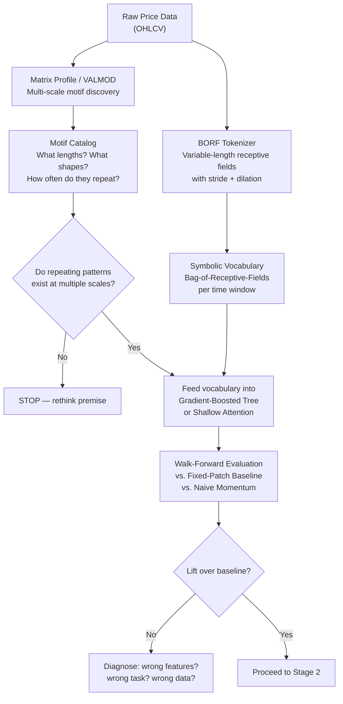
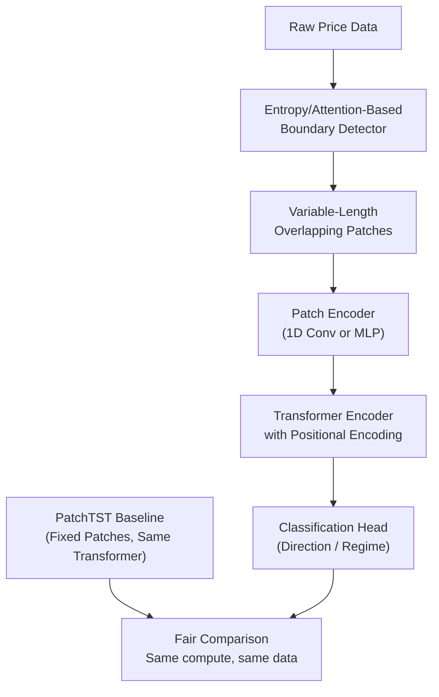
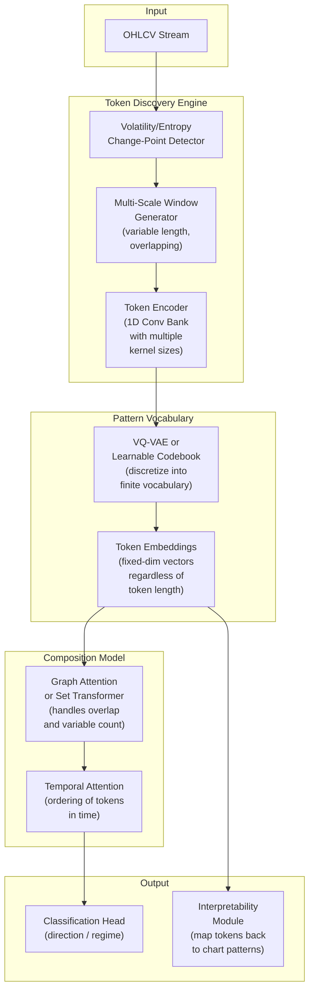

# Multi-Scale Overlapping Pattern Tokenization for Financial Time Series

> **Status**: Initial Brainstorm — Pre-Research Phase  
> **Date**: 2026-08-06  
> **Author**: Surya  
> **Domain**: Quantitative Finance × Deep Learning × Time Series Analysis

---

## 1. The Core Intuition

Human quants don't read price charts left-to-right, one tick at a time. They see **shapes** — head-and-shoulders spanning 40 bars, a double bottom compressed into 12 bars, a volatility squeeze visible only when you zoom out to weekly. They see these patterns at **multiple scales simultaneously**, and crucially, the patterns **overlap** — the right shoulder of one formation is the breakout candle of another.

Current ML approaches to financial time series largely ignore this. They either:

- Walk through data sequentially (RNNs, LSTMs, standard Transformers) — one step at a time, left to right
- Chop data into **fixed, non-overlapping** patches (PatchTST and derivatives) — rigid grid, no multi-scale
- Convert to 2D images with fixed transforms (GAF, MTF) — captures some structure but loses the "vocabulary" framing

**The question**: Can we build a system that discovers a **vocabulary of recurring, variable-length, overlapping local patterns** in price data — the way a quant's eye does — and use that vocabulary as the representational basis for downstream prediction or regime classification?

---

## 2. What Exactly Are We Proposing?

### 2.1 The Token Concept

Given a price series: `[100, 200, 300, 400, 500, 600]`

**Standard fixed patching** (e.g., PatchTST with patch_len=3, stride=3):
```
{100, 200, 300}  {400, 500, 600}
```
Two tokens. No overlap. One scale. Done.

**Our proposal** — dynamic, overlapping, multi-scale tokens:
```
{100, 200, 300}
{100, 200, 300, 400}
{300, 400}
{200, 300, 400, 500}
{100, 200, 300, 400, 500, 600}
{500, 600}
```

Each of these is a **candidate pattern token**. They vary in:
- **Length** — 2 elements to full series
- **Start position** — not grid-aligned
- **Overlap** — a single data point can belong to many tokens simultaneously
- **Scale** — short tokens capture micro-structure, long tokens capture macro-structure

### 2.2 The CNN Filter Analogy

This is directly analogous to how CNN filters work in computer vision:

| CNN on Images | Our Proposal on Price Data |
|---|---|
| Small 3×3 filters detect edges | Short tokens detect micro-patterns (spikes, gaps) |
| Large 7×7 filters detect textures | Medium tokens detect formations (flags, wedges) |
| Dilated convolutions see long-range | Long/dilated tokens detect macro-trends |
| Multiple filters at same layer | Multiple overlapping tokens at same time region |
| Receptive field grows with depth | Token vocabulary spans multiple scales |

The key insight from BORF (Bag-Of-Receptive-Fields): a time-series subsequence **is** a 1D receptive field. Varying length, stride, and dilation gives you the exact same multi-scale coverage that stacked convolutions give CNNs — but applied to discovering discrete pattern vocabularies.

### 2.3 The 2D Representation Angle

Beyond 1D subsequences, there's the question of **how** to look at each token. Options:

1. **Raw values** — the subsequence as a vector  
2. **Normalized shape** — z-scored or min-max normalized, so we match *shape* not *level*  
3. **2D image encoding** — convert each token into a mini Gramian Angular Field, Recurrence Plot, or candlestick image  
4. **Multi-channel** — stack price, volume, volatility as channels of a 2D patch (like RGB channels)

The 2D angle is compelling because it lets us apply **actual 2D convolution filters** — the same filters that are proven to detect visual patterns — directly on pattern-tokens derived from price data.

---

## 3. Literature Landscape — What Exists

### 3.1 Image-Based Time Series → CNN (Close, But Not Tokens)

| Method | What It Does | Gap vs. Our Idea |
|---|---|---|
| **GAF-CNN** (Gramian Angular Fields) | Converts full series to 2D image, applies CNN | Fixed single-scale image, not a vocabulary of tokens |
| **MTF** (Markov Transition Fields) | Encodes transition probabilities as 2D matrix | Statistical, not pattern-shape-based |
| **Recurrence Plots** | Visualizes recurring states as 2D image | Closer to our spirit, but one image per series |
| **Multi-resolution CNN ensembles** | Multiple time windows → separate CNNs → ensemble | Multi-scale yes, but still fixed windows |
| **TimesNet** (2023) | Reshapes 1D → 2D tensors per detected period, Inception-style multi-kernel conv | Elegant, but periods are FFT-detected and fixed per forward pass |

> [!NOTE]
> These methods validate the **instinct** that 2D/convolutional representations beat sequential ones for pattern detection. But none of them produce a discrete, reusable **vocabulary** of pattern tokens.

### 3.2 Patch Tokenization — The Current Default

| Method | What It Does | Gap vs. Our Idea |
|---|---|---|
| **PatchTST** (2023) | Fixed-length patches as Transformer tokens, channel-independent | Fixed length, overlap only via stride < patch_len |
| **Crossformer** | Cross-dimension attention on patches | Fixed patches, adds cross-variate attention |
| **TSMixer** | MLP-based mixing of fixed patches | Fixed patches, no learned boundaries |
| **xPatch** | Extends PatchTST with cross-patch attention | Still fixed-length patches |

> [!IMPORTANT]
> PatchTST is the **baseline to beat**. It's simple, strong, and well-tuned. Any dynamic tokenization scheme must demonstrably outperform it under fair conditions — not just on cherry-picked datasets.

### 3.3 Dynamic / Variable-Length Patching — The Frontier (2025–2026)

| Method | What It Does | Gap vs. Our Idea |
|---|---|---|
| **EntroPE** (2025) | Places patch boundaries at high predictive uncertainty | Variable-length, but non-overlapping, entropy-driven not shape-driven |
| **EAPformer** (2025) | Temporal entropy adjusts patch boundaries, good for volatile regimes | Variable-length, non-overlapping, designed for forecasting not pattern discovery |
| **TimeMosaic** (2025) | Segments by local information density, balances motif reuse vs. clarity | Variable-length, **explicitly non-overlapping** |

> [!WARNING]
> **Critical caution (June 2026 result)**: A stress-test paper showed that on standard long-horizon forecasting benchmarks, a properly tuned uniform-patch baseline is competitive with dynamic patching — gains are method- and dataset-specific, not a general law. Dynamic ≠ automatically better. Our architecture needs a fair fixed-patch comparison built in from day one.

### 3.4 Multi-Scale Motif Discovery — Pre-Deep-Learning, Directly Relevant

| Method | What It Does | Relevance |
|---|---|---|
| **Matrix Profile** | Nearest-neighbor distance for every subsequence at a given length | Foundation — tells you if repeated patterns exist at all |
| **VALMOD** | Generalizes Matrix Profile across a range of lengths simultaneously | Directly solves "what lengths matter?" without enumeration |
| **Matrix Profile for Finance** | Applied MP to find repeated behavioral patterns across indices/sectors | Direct domain validation |
| **BORF** (Bag-Of-Receptive-Fields) | Bridges CNN receptive fields and symbolic time-series tokenization | **Closest existing match to our idea** — variable-length, multi-scale, stride/dilation, symbolic vocabulary |
| **SAX / BOSS** | Sliding-window symbolic tokenization, bag-of-words classification | The ancestor — "treat subsequences like NLP tokens" |

> [!TIP]
> BORF is the most directly aligned prior work. It already does multi-scale receptive fields → discrete symbols → bag-of-words classification. The gap is: (a) it's not deep-learned end-to-end, (b) overlap is via stride not arbitrary, (c) it hasn't been specifically optimized for financial pattern vocabularies.

### 3.5 Human-Quant Pattern Recognition

| Method | What It Does | Relevance |
|---|---|---|
| **Lo, Mamaysky & Wang (2000)** | Kernel regression to formalize technical analysis patterns (H&S, double bottom) | The original "can machines see what quants see?" paper |
| **GAF-CNN candlestick recognition** | CNN reads candlestick images, reports >90% accuracy | Validates the visual approach, but accuracy claims need skepticism |
| **Byun et al. (2025)** | Vision Transformer on candlestick charts as an asset-pricing factor | Most recent, strongest result for ViT on chart images |

> [!CAUTION]
> The "90%+ accuracy" claims in chart-pattern classification are among the most overfitting-prone results in ML finance. Many don't survive honest out-of-sample, walk-forward, transaction-cost-aware testing. We must not fall into this trap.

---

## 4. The Gap — What Doesn't Exist Yet

No single paper or system does **all of the following simultaneously**:

```
┌─────────────────────────────────────────────────────────────┐
│                    THE OPEN RESEARCH GAP                     │
├─────────────────────────────────────────────────────────────┤
│                                                              │
│  ✓ Variable-length tokens        (EntroPE, TimeMosaic)       │
│  ✓ Multi-scale receptive fields  (BORF, TimesNet)            │
│  ✓ Overlapping windows           (Matrix Profile, SAX)       │
│  ✓ Learned boundaries            (EntroPE, EAPformer)        │
│  ✓ CNN-filter-style patterns     (BORF, GAF-CNN)             │
│  ✓ Human-legible chart patterns  (Lo et al., Byun et al.)   │
│  ✓ Financial domain application  (scattered across above)    │
│                                                              │
│  ✗ ALL OF THE ABOVE IN ONE SYSTEM — THIS IS THE GAP          │
│                                                              │
└─────────────────────────────────────────────────────────────┘
```

Specifically, what's missing is:

1. **Arbitrary overlap** — not just stride-based overlap, but content-aware overlap where a pattern boundary is determined by the data, and the same timestep can participate in many tokens of different lengths
2. **End-to-end learnable tokenizer** — where the token boundaries, lengths, and the embedding of each token are jointly optimized with the downstream task
3. **Interpretable vocabulary** — where the discovered tokens can be mapped back to recognizable chart patterns (flags, wedges, breakouts, consolidations) that a human quant would validate
4. **Financial-domain-aware evaluation** — walk-forward, transaction-cost-adjusted, not just MSE on a held-out set

---

## 5. Problem Statement (Formal)

> **Given** historical multivariate price/volume data for one or more financial instruments,  
> **Discover** a vocabulary of recurring, multi-scale, variable-length, overlapping local patterns ("tokens") — not constrained to a fixed window or non-overlapping grid —  
> **And test** whether representing market history as a composition of these tokens produces better **and** more interpretable predictive signal than standard fixed-window or purely sequential approaches,  
> **Under** realistic walk-forward evaluation with transaction costs.

### Sub-Problems

| # | Sub-Problem | Core Question |
|---|---|---|
| 1 | **Token Discovery** | How do we generate candidate variable-length, overlapping windows without O(T²) combinatorial explosion? |
| 2 | **Token Representation** | How do we embed each variable-length window into a comparable space? (Symbolic? Learned embedding? 2D image encoding?) |
| 3 | **Vocabulary Construction** | How do we cluster/discretize tokens into a finite, reusable vocabulary? |
| 4 | **Downstream Task** | Classification (directional move, regime) or forecasting? What evaluation protocol? |
| 5 | **Interpretability** | Can we map discovered tokens back to human-legible chart patterns? |

---

## 6. Proposed Methodology — Two-Stage Approach

### Stage 1: BORF + Matrix Profile Exploration (Weeks 1–3)

**Goal**: Determine whether variable-length, multi-scale repeated patterns **exist** in the target data at frequencies worth modeling, and whether a symbolic vocabulary of them carries predictive signal.



**Why start here:**
- BORF **already is** the idea, mostly built — multi-scale receptive fields → symbolic tokens
- Matrix Profile/VALMOD answers "do repeatable patterns exist?" without any ML
- It's deterministic, interpretable, and fast to prototype (days, not weeks)
- You can literally pull up the shapes it keys on and show them to a human quant
- If this shows **no signal**, the full deep-learning version won't either

**Specific steps:**
1. Pick 1–2 liquid instruments (e.g., SPY daily, AAPL daily) with 10+ years of history
2. Run VALMOD across length range [5, 200] bars to catalog motifs and their frequencies
3. Run BORF with multiple dilation/stride configs to generate receptive-field tokens
4. Train a LightGBM classifier on the token bag-of-words for next-day direction (up/down/flat with ±0.5% threshold)
5. Walk-forward evaluation: train on expanding window, test on next month, roll forward
6. Compare against: (a) raw-return momentum features, (b) fixed-length PatchTST embedding + same classifier

### Stage 2: Learned Dynamic Tokenizer + Transformer (Weeks 4–8)

**Goal**: If Stage 1 shows lift, replace the hand-crafted tokenizer with a **learned** one — end-to-end differentiable, content-aware boundary detection, with a Transformer backbone.



**Key design decisions to resolve before building:**

> [!IMPORTANT]
> These are the open questions that determine the architecture. Each needs a deliberate choice, not a default.

| Decision | Options | Leaning |
|---|---|---|
| **Boundary signal** | Entropy (EntroPE-style) vs. Learned attention gate vs. Volatility-based | Volatility-based for finance — it's the natural "regime change" signal |
| **Overlap mechanism** | Stride-based (simple) vs. Content-aware (each point votes on which tokens it joins) | Content-aware is the novel contribution, but stride-based is the safe start |
| **Token embedding** | Raw values → MLP vs. 1D Conv vs. Mini-GAF image → 2D Conv | 1D Conv first, add 2D later as ablation |
| **Positional encoding** | Absolute vs. Relative vs. Learnable | Relative (financial patterns are translation-invariant — a double bottom at t=100 means the same as at t=500) |
| **Downstream task** | Next-day direction vs. 5-day return bucket vs. Volatility regime | Start with next-day direction for fastest iteration |
| **Cross-instrument** | Single-instrument vs. Pooled training | Single first, pool after pipeline works |

---

## 7. Key Risks and Mitigations

| Risk | Why It Matters | Mitigation |
|---|---|---|
| **Combinatorial explosion** | O(T²) candidate windows for length T | Use a cheap routing signal (entropy, volatility breakpoint) to prune, not enumerate |
| **Overfitting** | Financial data is low-SNR, pattern-based methods are notoriously overfit-prone | Strict walk-forward evaluation, no in-sample tuning, transaction costs included |
| **Dynamic patching ≠ better** | June 2026 stress-test showed no consistent advantage over well-tuned fixed patches | Build fair fixed-patch baseline in same architecture, same compute budget |
| **Interpretability theater** | "We can visualize the tokens" ≠ "the tokens are actually meaningful" | Have a human quant label a sample of discovered patterns blind, measure agreement |
| **Data snooping** | Looking at the data to design the method, then testing on the same data | Pre-register the evaluation protocol before running experiments |
| **Survivorship bias** | Only testing on liquid, surviving instruments | Include delisted instruments in training if available |

---

## 8. Evaluation Protocol (Non-Negotiable)

This section is **not optional**. Financial ML is littered with papers that report great results under sloppy evaluation. We won't add to that pile.

### Walk-Forward Design
```
Training:    [────────────expanding──────────────]
Validation:  [──────]  (parameter tuning only, no architecture search)
Test:        [──────]  (untouched, one forward pass, report this number)
              ────────────────────────────────────────────▶ time
Roll forward by 1 month, repeat.
```

### Metrics (Report ALL of These)
- **Directional accuracy** — % correct up/down/flat calls
- **Sharpe ratio** — of a strategy that goes long/short/flat based on predictions
- **Max drawdown** — worst peak-to-trough
- **Turnover** — how often the model changes its mind (proxy for transaction costs)
- **Net Sharpe after costs** — Sharpe after deducting realistic transaction costs (10bps round-trip for equities)
- **Calibration** — does a 70% confidence prediction come true 70% of the time?

### Baselines (Beat ALL of These or the Method Doesn't Work)
1. **Buy-and-hold** — the floor
2. **Naive momentum** — sign of trailing 20-day return
3. **Fixed-patch PatchTST** — same Transformer backbone, fixed patches, well-tuned
4. **LSTM** — sequential baseline to prove non-sequential representation helps

---

## 9. What We Need to Understand Before Writing Code

This is the honest "we don't know yet" section. These questions need answers from literature review, data exploration, or small experiments before committing to an architecture.

### Fundamental Questions

1. **Do repeating multi-scale patterns actually exist in liquid equity prices?**
   - Matrix Profile/VALMOD can answer this empirically
   - If the answer is "not really, prices are mostly random walk + drift," the whole premise collapses — and that's fine, it's better to know early

2. **At what scales do patterns repeat?**
   - Intraday? Daily? Weekly? Monthly?
   - This determines minimum/maximum token length
   - Likely answer: mostly at 5–50 bar scale for daily data (1 week to 2.5 months)

3. **How many distinct patterns are there?**
   - Vocabulary size matters enormously — too small and you lose resolution, too large and you overfit
   - SAX/BOSS literature suggests 50–500 symbols is the productive range for time series
   - Need to run BORF/SAX and look at the cluster distribution

4. **Does overlap help or hurt?**
   - Overlapping tokens = redundant information = risk of overfitting
   - But also = richer representation = might capture boundary patterns that non-overlapping misses
   - This is an empirical question, not a theoretical one — ablation study required

5. **Is direction classification the right task?**
   - Maybe regime classification (trending/mean-reverting/volatile) is a better first target
   - Maybe the tokens are more useful as features fed into an existing quant model than as a standalone predictor
   - This affects architecture choices significantly

### Technical Questions

6. **How do we handle variable-length tokens in a Transformer?**
   - Transformers expect fixed-dimension inputs
   - Options: pad to max length, use pooling (mean/max/attention), or use a set-transformer
   - PatchTST solved this by making all patches the same length — we can't do that

7. **How do we encode positional information for overlapping tokens?**
   - Standard positional encoding assumes a sequence — our tokens form a **graph** (overlapping, multi-scale)
   - May need graph attention or a custom positional scheme

8. **What's the computational budget?**
   - Single GPU? Multi-GPU? Cloud?
   - This constrains vocabulary size, number of overlapping windows, and model complexity

---

## 10. Immediate Next Steps

```
Week 1:
├── [ ] Literature deep-dive: Read BORF, VALMOD, EntroPE, TimeMosaic papers in full
├── [ ] Data acquisition: Download 10+ years of daily OHLCV for SPY, AAPL, QQQ
├── [ ] Matrix Profile exploration: Run VALMOD on SPY, visualize motifs at multiple lengths
└── [ ] Answer Question 1: Do repeating patterns exist? At what scales?

Week 2:
├── [ ] BORF prototype: Run BORF tokenization on SPY, inspect the vocabulary
├── [ ] Baseline models: Train LightGBM on raw features + momentum features
├── [ ] First experiment: BORF tokens → LightGBM → walk-forward evaluation
└── [ ] Answer Question 3: How many distinct tokens? What do they look like?

Week 3:
├── [ ] Overlap ablation: Compare non-overlapping vs. stride-overlapping vs. content-overlapping tokens
├── [ ] Multi-instrument: Pool SPY + AAPL + QQQ training, evaluate per-instrument
├── [ ] Interpretability check: Show top-10 tokens to a human, ask "what pattern is this?"
└── [ ] Go/no-go decision for Stage 2
```

---

## 11. Reference Architecture (Aspirational — Stage 2+)

This is what the full system might look like if Stage 1 validates the premise. Not for building now — for orienting the thinking.



---

## 12. Key Papers to Read (Priority Order)

| Priority | Paper | Why |
|---|---|---|
| 🔴 **Must Read** | BORF: Bag-Of-Receptive-Fields | Closest prior work to our exact idea |
| 🔴 **Must Read** | PatchTST | The baseline architecture we must beat |
| 🔴 **Must Read** | TimesNet | Best existing 2D-conv approach to time series |
| 🔴 **Must Read** | "Does Dynamic Patching Help?" (June 2026) | The sobering reality check on dynamic tokenization |
| 🟡 **Should Read** | EntroPE | Best entropy-based dynamic boundary detection |
| 🟡 **Should Read** | TimeMosaic | Variable-length patches via information density |
| 🟡 **Should Read** | VALMOD (Variable-Length Matrix Profile) | Multi-scale motif discovery foundation |
| 🟡 **Should Read** | Lo, Mamaysky & Wang (2000) | Original technical pattern formalization |
| 🟢 **Nice to Have** | Byun et al. (2025) ViT on candlestick charts | Latest vision-transformer approach to chart reading |
| 🟢 **Nice to Have** | EAPformer | Entropy-aware patching for multivariate |
| 🟢 **Nice to Have** | GAF-CNN literature | Foundational image-encoding approach |

---

## 13. Success Criteria

How do we know if this research direction is worth pursuing beyond the brainstorm phase?

### Stage 1 Success (Go/No-Go for Stage 2)
- [ ] Matrix Profile confirms repeating motifs exist at ≥3 distinct scales in SPY daily data
- [ ] BORF token vocabulary of size 50–500 is achievable without degenerate clusters
- [ ] BORF + LightGBM achieves directional accuracy >53% walk-forward (above random + transaction costs)
- [ ] At least 5 of the top-20 tokens are recognizable as known chart patterns by visual inspection

### Stage 2 Success (Publishable / Deployable)
- [ ] Learned tokenizer + Transformer beats well-tuned PatchTST on net Sharpe after costs
- [ ] Improvement is consistent across ≥3 instruments, not cherry-picked
- [ ] Interpretability module maps ≥30% of vocabulary to labeled chart patterns with human agreement >70%
- [ ] Results survive a fresh out-of-sample period not used in any development

---

> [!NOTE]
> **This document is a living brainstorm.** It will be updated as we explore the literature, run experiments, and refine the approach. The key principle: **validate cheap before building expensive**. Matrix Profile and BORF cost hours. A custom dynamic-tokenizer Transformer costs weeks. Do the hours first.
